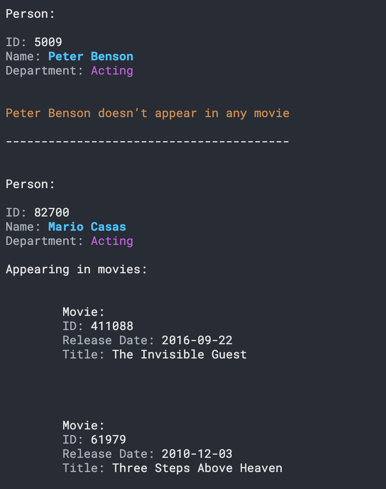

`#node.js` `#master-in-software-engineering`


1. Create API_KEY 
   https://www.themoviedb.org/signup
2. Create .env file with API_KEY (process.env.API_KEY)

  /****** CLI PROGRAM *****/

 3.  Popular persons 
  ----------------
  3.1  URL: https://api.themoviedb.org/3/person/popular?page=1 
  - Required fields: 
    - description: "Make a network request to fetch the most popular persons"
    - options:
      - --popular (-p) REQUIRED ("Fetch the popular persons")
      - --page (none) (input type: number) REQUIRED ("The page of persons data results to fetch")
  3.2 Start terminal spinner using ora (https://github.com/sindresorhus/ora) that renders the following message until the request has finished: "Fetching the popular person's data..."
  3.3 Create https request file (https://nodejs.org/api/https.html#https_https_request_options_callback)
  3.4 ERROR HANDLER -> ora.fail()
  3.5 RENDERING RESULT -> chalk (https://github.com/chalk/chalk)
    - Use chalk.white() method to render pagination
    - Use chalk for rendering persons data
    - If person appears in movies:
        - Use chalk for rendering movies
  3.6 Ending the terminal spinner using ora.succeed()

4. Persons details
------------------
  4.1 URL: https://api.themoviedb.org/3/person/:id
  - Required fields:
    - description: "Make a network request to fetch the data of a single person"
    - options:
      - --id (-i) REQUIRED ("The id of the person")
  4.2 Start terminal spinner using ora (https://github.com/sindresorhus/ora)
  4.3 Create https request file (https://nodejs.org/api/https.html#https_https_request_options_callback)
  4.4 ERROR HANDLER -> ora.fail()
  4.5 Rendering using chalk
  4.6 Ending the terminal spinner using ora.succeed()

5. REQUIEREMENTS

  - GIT
  - Directory structure
  - English comments
  - camelCase
  - Subtasks
  - Delete files not used 

6. DELIVERABLES

  - Repository
  - Postman collection
  - README

7. RESOURCES

● Oficial web page: https://nodejs.org/en/docs/
● W3schools: https://www.w3schools.com/nodejs/
● NodeJS Tutorial: https://www.tutorialsteacher.com/nodejs/nodejs-tutorials
● chalk: https://www.npmjs.com/package/chalk
● commander: https://www.npmjs.com/package/commander
● dotenv: https://www.npmjs.com/package/dotenv
● node-notifier: https://www.npmjs.com/package/node-notifier
● ora: https://www.npmjs.com/package/ora/v/0.3.0


<!-- ALL-CONTRIBUTORS-BADGE:START - Do not remove or modify this section -->

[](#contributors-)

<!-- ALL-CONTRIBUTORS-BADGE:END -->

# Assembler School: Node.js MovieDB CLI App <!-- omit in toc -->

In this project you will learn how to create a cli app with Node.js.

## Table of Contents <!-- omit in toc -->

- [3.  Popular persons](#3--popular-persons)
- [4. Persons details](#4-persons-details)
- [Getting Started](#getting-started)
  - [The repository](#the-repository)
  - [Fetching All the Branches](#fetching-all-the-branches)
  - [List Both Remote Tracking Branches and Local Branches](#list-both-remote-tracking-branches-and-local-branches)
  - [Installing](#installing)
  - [Running the Tests](#running-the-tests)
  - [Git `precommit` and `prepush` Hooks](#git-precommit-and-prepush-hooks)
- [The Project](#the-project)
- [Project requirements](#project-requirements)
- [Project delivery](#project-delivery)
- [Resources](#resources)

## Getting Started

These instructions will get you a copy of the project up and running on your
local machine for development and testing purposes.

See deployment for notes on how to deploy the project on a live system.

### The repository

First, you will need to `clone` or `fork` the repository into your Github
account:


```
$ git clone https://github.com/assembler-school/node-moviedb-cli.git
```

## Contents and Branches Naming Strategy <!-- omit in toc -->

The repository is made up of several branches that include the contents of each
section.

The branches follow a naming strategy like the following:

- `main`: includes the main contents and the instructions
- `assembler-solution`: includes the solution

### Fetching All the Branches

In order to fetch all the remote branches in the repository, you can use the
following command:

```sh
$ git fetch --all
```

### List Both Remote Tracking Branches and Local Branches

```sh
$ git branch --all
```

Then, you can create a local branch based on a remote branch with the following
command:

```sh
$ git checkout -b <new_branch_name> <remote_branch_name>
```

### Installing

First, you will need to install the dependencies with: `npm install`.

Run the following command in your terminal after cloning the main repo:

```sh
$ npm install
```

### Running the Tests

The tests that validate your solution can be executed by runing the following
command:

```
$ npm run test
```

### Git `precommit` and `prepush` Hooks

In the `assembler-solution` branch you can see an implementation of these tools
if you'd like to use them.

## Deployment <!-- omit in toc -->

In this pill we won't deploy the app.

## Technologies used <!-- omit in toc -->

- `Node.js`
- `eslint`
- `prettier`
- `lint-staged`
- `husky`

## The Project

In this project you will build a cli app similar to the following screenshot.



## Project requirements

This is an overview of the main requirements of this project. The exact ones are
found in the doc that the academic team will provide you.

- You must follow all the instructions of the project step-by-step
- You should always try to solve them by yourself before asking for help
- You should always help your team members and fellow students of the master so
  that you can all learn together and become better software developers and team
  members
- You must finish all the steps that are marked as `Required`
- Once you are done, you can move on to the optional ones that are marked as
  `Extra 💯`

## Project delivery

To deliver this project you must follow the steps indicated in the document:

- [Submitting a solution](https://www.notion.so/Submitting-a-solution-524dab1a71dd4b96903f26385e24cdb6)

## Resources

- See the document we provide

## License <!-- omit in toc -->

This project is licensed under the MIT License - see the [LICENSE](LICENSE) file
for details

## Contributors ✨ <!-- omit in toc -->

Thanks goes to these wonderful people
([emoji key](https://allcontributors.org/docs/en/emoji-key)):

<!-- ALL-CONTRIBUTORS-LIST:START - Do not remove or modify this section -->
<!-- prettier-ignore-start -->
<!-- markdownlint-disable -->
<table>
  <tr>
    <td align="center"><a href="http://www.danilucaci.com"><br /><sub><b>Dani Lucaci</b></sub></a><br /><a href="https://github.com/assembler-school/vanilla-js-project-template/commits?author=danilucaci" title="Code">💻</a> <a href="https://github.com/assembler-school/vanilla-js-project-template/commits?author=danilucaci" title="Documentation">📖</a> <a href="#example-danilucaci" title="Examples">💡</a> <a href="#tool-danilucaci" title="Tools">🔧</a></td>
  </tr>
</table>

<!-- markdownlint-restore -->
<!-- prettier-ignore-end -->

<!-- ALL-CONTRIBUTORS-LIST:END -->

This project follows the
[all-contributors](https://github.com/all-contributors/all-contributors)
specification. Contributions of any kind welcome!
