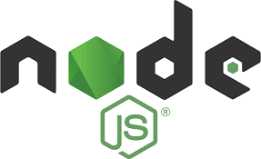

<!-- PROJECT LOGO -->
<br />
<p align="center">
  <a href="https://github.com/othneildrew/Best-README-Template">
    
  </a>

  <h3 align="center">Command Line Application with Node.js</h3>

  <p align="center">
    This project help us to understand nodeJs.
    <br />
    <a href="https://github.com/bbenalia/node-moviedb-cli"><strong>Explore the docs »</strong></a>
    <br />
    <br />
    <a href="https://github.com/bbenalia/node-moviedb-cli">View Demo</a>
    ·
    <a href="https://github.com/bbenalia/node-moviedb-cli">Report Bug</a>
    ·
    <a href="https://github.com/bbenalia/node-moviedb-cli">Request Feature</a>
  </p>
</p>


<!-- TABLE OF CONTENTS -->
<details open="open">
  <summary>Table of Contents</summary>
  <ol>
    <li>
      <a href="#about-the-project">About The Project</a>
      <ul>
        <li><a href="#built-with">Built With</a></li>
      </ul>
    </li>
    <li>
      <a href="#getting-started">Getting Started</a>
      <ul>
        <li><a href="#prerequisites">Prerequisites</a></li>
        <li><a href="#installation">Installation</a></li>
      </ul>
    </li>
    <li><a href="#usage">Usage</a></li>
    <li><a href="#roadmap">Roadmap</a></li>
    <li><a href="#contributing">Contributing</a></li>
    <li><a href="#license">License</a></li>
    <li><a href="#contact">Contact</a></li>
    <li><a href="#acknowledgements">Acknowledgements</a></li>
  </ol>
</details>


<!-- ABOUT THE PROJECT -->
## About The Project


We will be building a CLI(command line) app that takes user input, which will be a page (or some other parameters), using a flag argument and uses this argument to make a http request to a REST API, the api we will be using is provided by [www.themoviedb.org](https://www.themoviedb.org) . The api provides information on a movie/person as requested using a parameter. We would consume this API to get the population of a country.

To parse CL arguments we will use `Commander`, a node package. To make http requests we will use `Http` Node Module .

Here's why:
* Learn more about the asyncronous workflow of Node.js
* Interact easily with 3rth APi's.
* Learn how to manipulate Tokens.

### Built With

This section should list any major frameworks that you built your project using. Leave any add-ons/plugins for the acknowledgements section. Here are a few examples.

- `Node.js`
- `Commander.Js`
- `Dotenv`
- `node-notifier`
- `ora` spinners
- `prettier`

<!-- GETTING STARTED -->
## Getting Started

First of all you need to have installed node and git into your PC. 

### Prerequisites

This is an example of how to list things you need to use the software and how to install them.

* npm
  ```sh
  npm install npm@latest -g
  ```

### Installation

1. Get a free API Key at [https://www.themoviedb.org/](https://www.themoviedb.org/)
2. Clone the repo
   ```sh
   git clone https://github.com/bbenalia/node-moviedb-cli
   ```
3. Install NPM packages
   ```sh
   npm install
   ```
4. Enter your API in `.env`
   ```JS
   const API_KEY = 'ENTER YOUR API';
   ```

<!-- USAGE EXAMPLES -->
## Usage

- `./moviedb.js command... ---options... --flags...`
- `./moviedb.js get-persons --page 1 --popular`
- `./moviedb.js get-persons --page 2 --popular`

- `./moviedb.js get-person --id XXXXXXXX`
- `./moviedb.js get-person --id 990393`

- `./moviedb.js get-movies --popular --page 2`
- `./moviedb.js get-movies --now-playing --page 2`

- `./moviedb.js get-movie --id movieId`
- `./moviedb.js get-movie --id 694919`

If you want to save your data request use:

`--save`
`--local`


_For more examples, please refer to the [Documentation](https://example.com)_


<!-- ROADMAP -->
## Roadmap

See the [open issues](https://github.com/assembler-school/node-moviedb-cli/issues) for a list of proposed features (and known issues).

<!-- CONTRIBUTING -->
## Contributing

Contributions are what make the open source community such an amazing place to be learn, inspire, and create. Any contributions you make are **greatly appreciated**.

1. Fork the Project
2. Create your Feature Branch (`git checkout -b feature/AmazingFeature`)
3. Commit your Changes (`git commit -m 'Add some AmazingFeature'`)
4. Push to the Branch (`git push origin feature/AmazingFeature`)
5. Open a Pull Request

<!-- LICENSE -->
## License

Distributed under the MIT License. See `LICENSE` for more information.

<!-- CONTACT -->
## Team Contact

Thanks goes to these wonderful people ([emoji key](https://allcontributors.org/docs/en/emoji-key)):

<!-- ALL-CONTRIBUTORS-LIST:START - Do not remove or modify this section -->
<!-- prettier-ignore-start -->
<!-- markdownlint-disable -->
<table>
  <tr>
    <td align="center"><a href="https://github.com/haykbit"><br /><sub><b>haykbit</b></sub></a><br /><a href="https://github.com/bbenalia/node-moviedb-cli/commits?author=haykbit" title="Code">💻</a></td>
    <td align="center"><a href="https://github.com/imalovelyghost"><br /><sub><b>imalovelyghost</b></sub></a><br /><a href="https://github.com/bbenalia/node-moviedb-cli/commits?author=imalovelyghost" title="Code">💻</a></td>
  </tr>
</table>

Project Link: [https://github.com/your_username/repo_name](https://github.com/your_username/repo_name)


<!-- MARKDOWN LINKS & IMAGES -->
<!-- https://www.markdownguide.org/basic-syntax/#reference-style-links -->
[contributors-shield]: https://github.com/bbenalia/node-moviedb-cli
[contributors-url]: https://github.com/othneildrew/Best-README-Template/graphs/contributors
[forks-shield]: https://github.com/assembler-school/node-moviedb-cli
[forks-url]: https://github.com/othneildrew/Best-README-Template/network/members
[stars-shield]: https://img.shields.io/github/stars/othneildrew/Best-README-Template.svg?style=for-the-badge
[linkedin-shield]: https://www.linkedin.com/feed/
[product-screenshot]: /src/img/project.png
